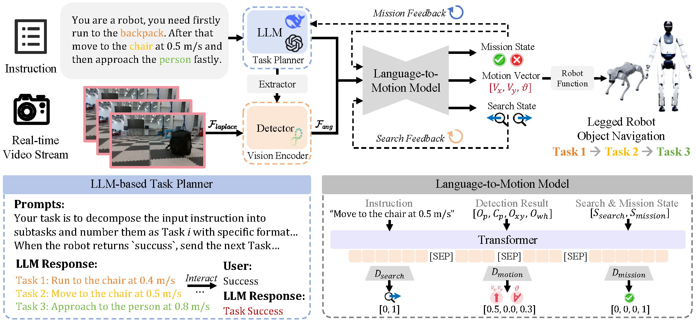

 
# LOVON: Legged Open-Vocabulary Object Navigator</a>

  

## 💡 Introduction

LOVON, a novel framework that integrates large language models (LLMs) for hierarchical task planning with open-vocabulary visual detection models, tailored for effective long-range object navigation in dynamic, unstructured environments.

  

## TODO List

We are currently working on organizing the code for the LOVON project, and it will be released progressively. The upcoming tasks include:

- [ ] **Training Details**: Provide detailed information about the model training process, including configurations, hyperparameters, and training procedures.

- [ ] **More Details About Dataset Generation**: Provide additional information on dataset generation。
